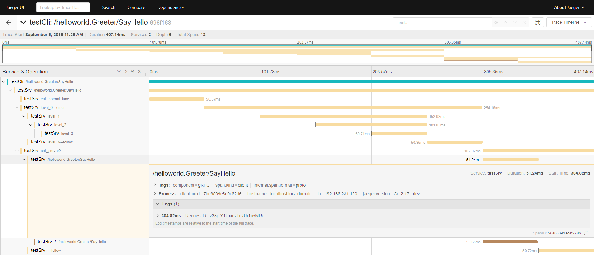

# Run the example

## 1）deploy a jaeger-server

You can run the jaeger server in docker at local for debug,<br>
such as:
```bash
$ docker run -d --name jaeger \   
  -p 5775:5775/udp \
  -p 6831:6831/udp \
  -p 6832:6832/udp \
  -p 5778:5778 \
  -p 16686:16686 \
  -p 14268:14268 \  
  jaegertracing/all-in-one:latest
```
jaeger-agent address: `127.0.0.1:6831`, <br>
jaeger-ui address: `http://127.0.0.1:16686/`.

## 2）run the examples
***Make sure you have update "github.com/xiaomi-tc/log15" to the last version, or the compile may report error !!!*** 

Run  `go run ./main.go` in directorys: `server, server2, client` separately ,<br>
or build them first by `go build` , then run.

## 3）get the result from the UI
Open the url `http://127.0.0.1:16686/`, and search the specified service.Then you should see the result like this as below：<br>


